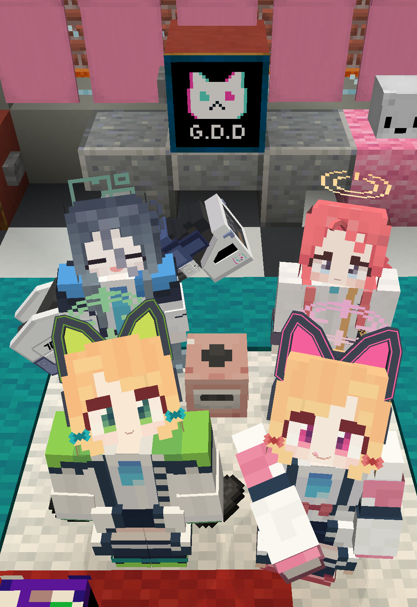
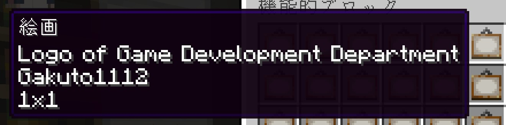

# GDDLogoPainting
[ブルーアーカイブ](https://bluearchive.jp/)の[ゲーム開発部](https://dic.pixiv.net/a/ゲーム開発部)のロゴの絵画を追加する、[マインクラフト](https://www.minecraft.net/ja-jp)のデータパックとリソースパックです。

対応マインクラフトバージョン：1.21.4



（写真に写っているキャラクターに関しては[こちら](https://github.com/Gakuto1112/FiguraBlueArchiveCharacters)をご覧ください。） <!-- EXCLUDED_LINE -->

## このデータパックとリソースパックについて
こちらのデータパックとリソースパックでは、ブルーアーカイブのゲーム開発部のロゴが描かれた絵画を追加します。
絵画の大きさは1x1ブロックです。

また、これらのパックでは、既存のバニラ絵画に加えて独自の絵画を追加する方式を採っているため、既存のバニラ絵画が置き換えられることはありません。

追加された絵画はクリエイティブインベントリからアクセスできるほか、通常のランダム絵画からも出現します。



## 使用方法
1. [リリースページ](https://github.com/Gakuto1112/GDDLogoPainting/releases)より、データパックとリソースパックをダウンロードします。
2. ダウンロードした圧縮ファイルを展開します。
3. `datapack/`内にある"GDDLogoPainting"を`<マインクラフトのゲームフォルダ>/saves/<導入したいワールドのフォルダ>/datapacks/`に移動します。
4. `resourcepack/`内にある"GDDLogoPainting"を`<マインクラフトのゲームフォルダ>/resourcepacks/<導入したいワールドのフォルダ>/datapacks/`に移動します。
5. ゲーム内の設定 → 「リソースパック」より、「GDDLogoPainting」を右側の「選択中」に移動してリソースパックを再読み込みします。
6. データパックを導入したワールドに入ります。
7. チャット欄より次のコマンドを実行してデータパックを有効化します（チートコマンドを実行する権限が必要です）。
   ```
   /datapack enable "file/GDDLogoPainting"
   ```
8. 一度ワールドに入りなおします。
9. クリエイティブインベントリの「機能的ブロック」タブに絵画が追加されていれば導入成功です。

## 注意事項
- このデータパック及びリソースパックを使用して発生した、いかなる損害の責任も負いかねます。
- 不具合がありましたら、[Issues](https://github.com/Gakuto1112/GDDLogoPainting/issues)までご連絡ください。
